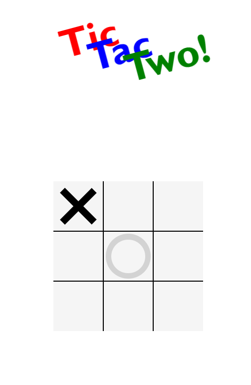

__Tic-tac-toe__, noughts and crosses, or Xs and Os is a paper-and-pencil game for two players who take turns marking the spaces in a three-by-three grid with X or O. The player who succeeds in placing three of their marks in a horizontal, vertical, or diagonal row is the winner. [Wikipedia](https://en.wikipedia.org/wiki/Tic-tac-toe)

[Link](https://shemmyyo.github.io/tic-tac-toe-js/)

